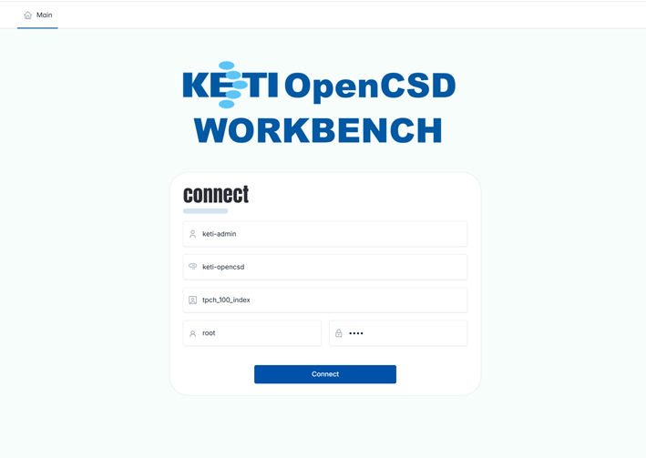
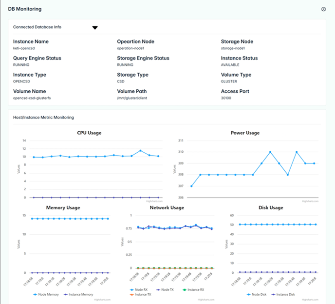
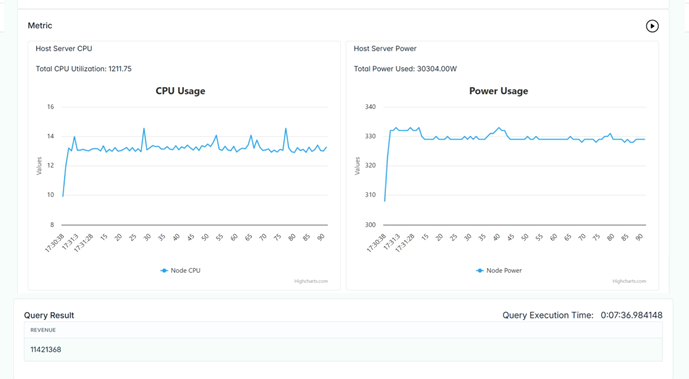
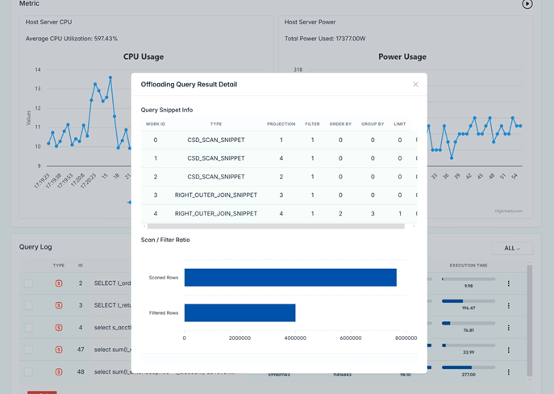
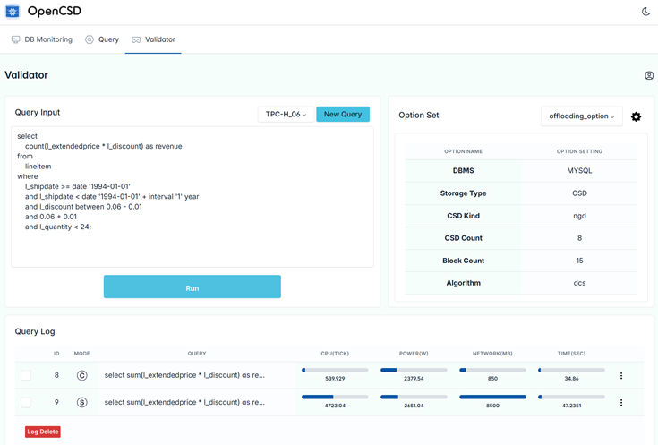
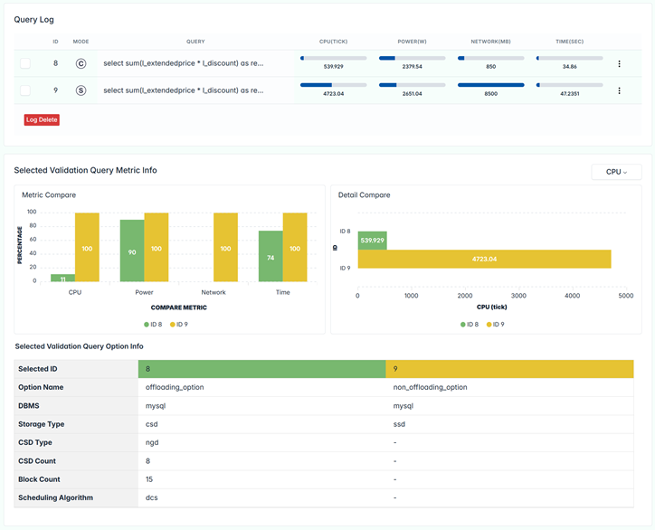

# Introduction of KETI-Web-Workbench
-------------

KETI-Web-Workbench enables users to monitor databases, perform query pushdown, and run validator to analyze resource utilization and energy savings.

## Contents
-------------
[1. Requirement](#requirement)

[2. How To Install](#How-To-Install)

[3. How To Use](#How-To-Use)

[4. Governance](#governance)


## Requirement
-------------
>   Python 3.7.5 <br>
>   Flask 2.2.5 <br>
>   Werkzeug 2.2.3


## How To Install
-------------
```bash
git clone
python3 main.py
```

## How To Use
-------------
### 1. Access a Web page
```bash
http://{address}:40805
```


### 2. Access a DB Monitoring Page
- Check DB Info
- Monitor DB Metrics
- Monitor Host Server Metrics



### 3. Access a Query Pushdown Page
- Run Query
- Check Query Result
- Check Query Metric
- Check Host Server Metrics
- Check Query Log




### 4. Access a Validation Page
- Run Query
- Set Query Pushdown Option
- Check Query Log
- Compare two query results




## Governance
-------------
This work was supported by Institute of Information & communications Technology Planning & Evaluation (IITP) grant funded by the Korea government(MSIT) (No.2021-0-00862, Development of DBMS storage engine technology to minimize massive data movement)

